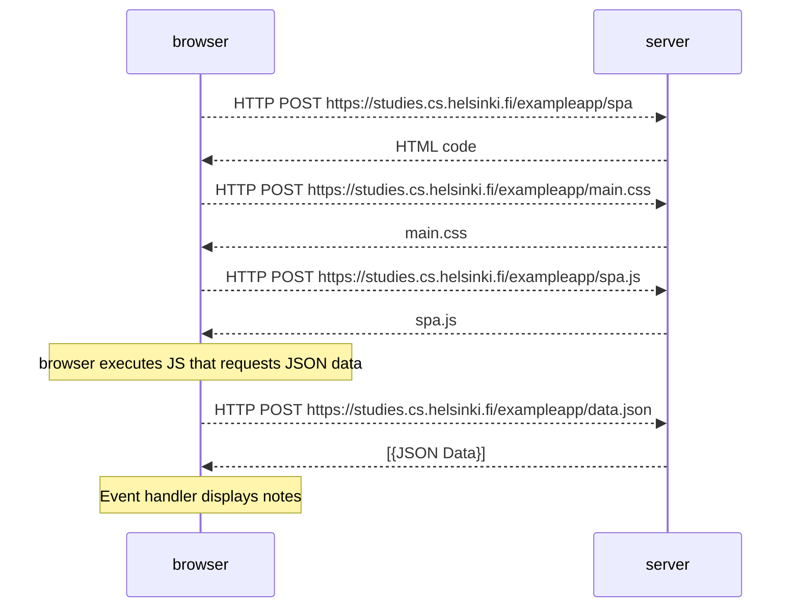

0.5 SPA Diagram

```mermaid
sequenceDiagram;
  browser-->>server: HTTP POST https://studies.cs.helsinki.fi/exampleapp/spa
  server-->>browser: HTML code
  browser-->>server: HTTP POST https://studies.cs.helsinki.fi/exampleapp/main.css
  server-->>browser: main.css
  browser-->>server: HTTP POST https://studies.cs.helsinki.fi/exampleapp/spa.js
  server-->>browser: spa.js
  note over browser: browser executes JS that requests JSON data
  browser-->>server: HTTP POST https://studies.cs.helsinki.fi/exampleapp/data.json
  server-->>browser: [{JSON Data}]
  note over browser: Event handler displays notes
```