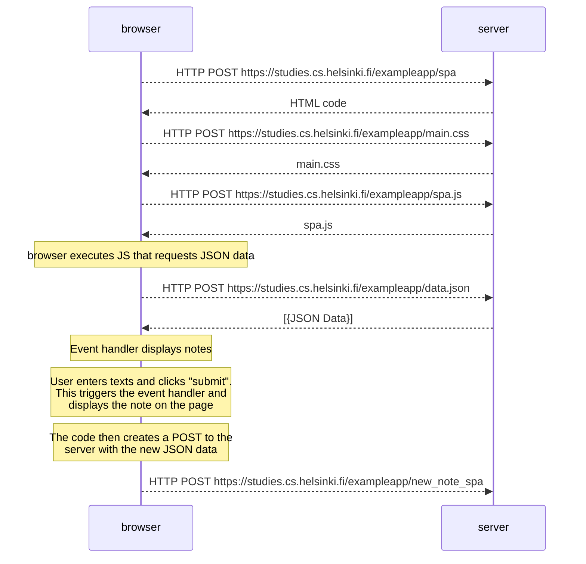

0.6 New note in Single Page App diagram

```mermaid
sequenceDiagram
  browser-->>server: HTTP POST https://studies.cs.helsinki.fi/exampleapp/spa
  server-->>browser: HTML code
  browser-->>server: HTTP POST https://studies.cs.helsinki.fi/exampleapp/main.css
  server-->>browser: main.css
  browser-->>server: HTTP POST https://studies.cs.helsinki.fi/exampleapp/spa.js
  server-->>browser: spa.js
  note over browser: browser executes JS that requests JSON data
  browser-->>server: HTTP POST https://studies.cs.helsinki.fi/exampleapp/data.json
  server-->>browser: [{JSON Data}]
  note over browser: Event handler displays notes
  note over browser: User enters texts and clicks "submit". <br>This triggers the event handler and <br> displays the note on the page
  note over browser: The code then creates a POST to the <br>server with the new JSON data
  browser-->>server: HTTP POST https://studies.cs.helsinki.fi/exampleapp/new_note_spa
```